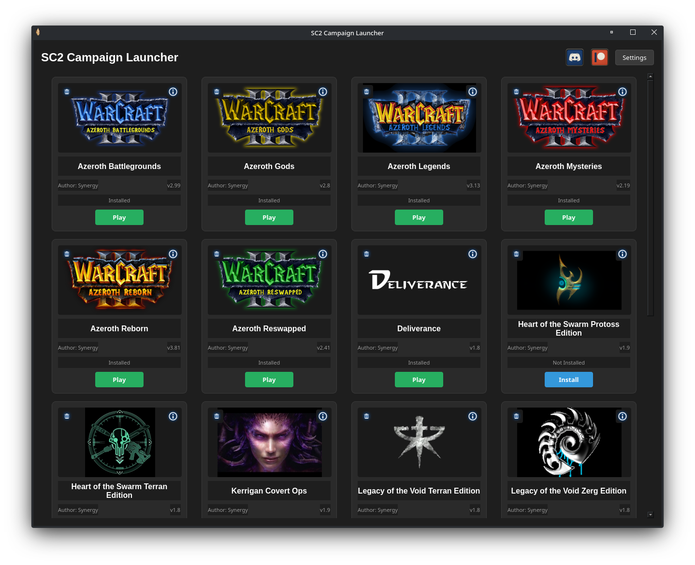

# SC2_Campaign_Launcher_Linux

 Synergy's SC2 Campaign Launcher, completely rewritten for Linux
 
While I do use this to manage Synergy's Campaigns on my personal computers, it is not well tested outside of CachyOS and my specific system (all dependencies already installed, etc.) so if you run into a problem, feel free to submit an Issue and I should be able to get that addressed!  Just provide what distro you're using and any other information that might be relevant.

# Manual Usage

For the majority of users I recommend using the Release "Easy Installer" it's quick and painless.  If you want a manual "portable install"...

1: Install dependencies 'python PyQt6 umu-launcher optional: Proton'
2: Launch script using python 'python3 /path/to/script.py

Note that assets will not load correctly if you don't download the entire repo, which is handled by the installer.

# Upcoming Features (roughly in order of importance)

Support for moving campaigns when wine prefix is changed (or at least remove previous campaigns, launcher will still think campaigns are installed if Wine prefix is changed).

"Last updated" field in campaign details.

Update UX to install/uninstall script (if run with the remote installer or the .desktop installer it already does this, but the interface is not clear about that).

Remove or disable delete button from campaigns that are not currently installed.

Integrate Naturalize with easy SC2 installation (undeveloped application, on the bucket list)
https://github.com/MetalMan1245/naturalize

# License

StarCraft II is © Blizzard Entertainment.
I do not claim ownership of the any assets.

# Notes

This is a vibe coded project, I do use it myself but be warned, I am not an extrmely skilled developer, I just wanted to see an easier version of this exist for Linux.

The oriinal SC2 Campaign Launcher that is Windows exclusive can be found here (no source code):

https://github.com/R-P-S/SC2CampaignLauncher

The maps for the launcher are kept here:

https://github.com/R-P-S/SC2Campaigns

I took inspiration from ZachZimm who originally ported the project to Linux, and he's been very helpful and supportive, this version is more complicated but worth a look since it's the original launcher by R-P-S:

https://github.com/ZachZimm/Synergy-Mod-Launcher-Linux

I haven't used it myself but there is supposed to be a macOS version of the launcher, check it out if you're on macOS:

https://github.com/Swagdude7/SC2-Synergy-Launcher-Mac
